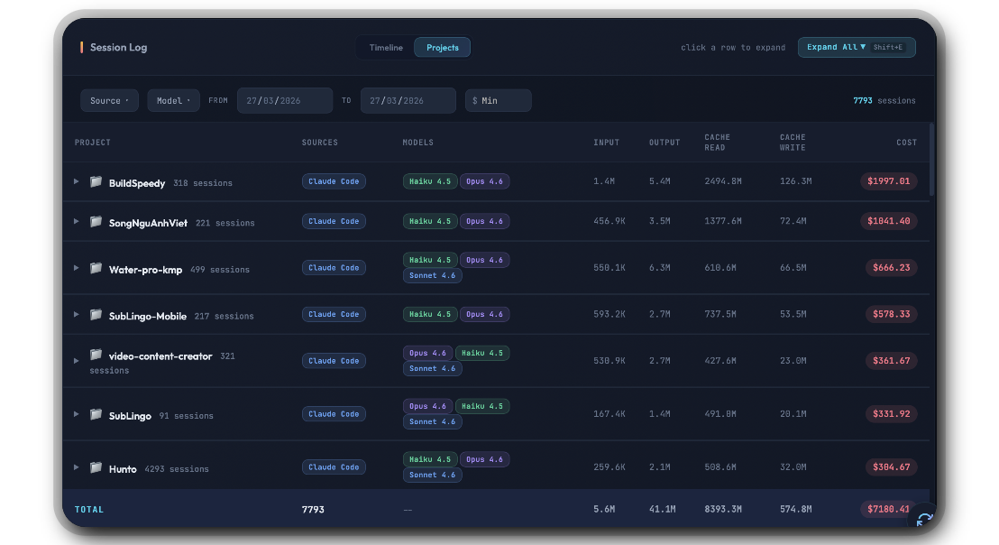
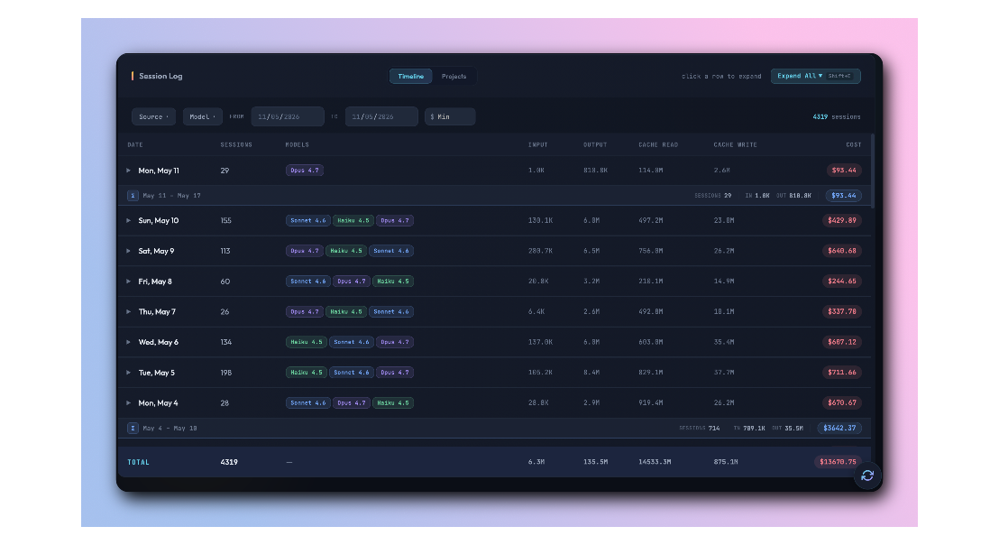
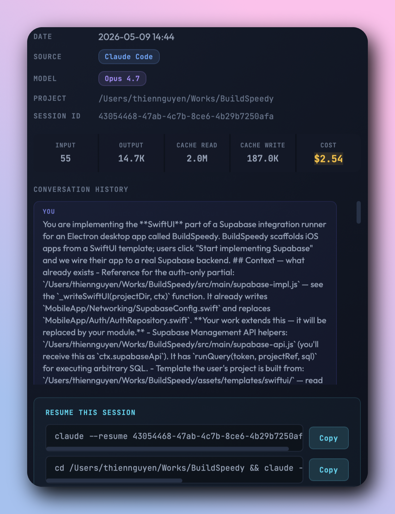

<div align="center">

# 🧾 Claude Usage Tracker

### Track and visualize Claude AI usage costs across all your local development tools

<p>
  
  
  
  
  
</p>

<p>
  <a href="#-quick-start"><strong>Quick Start</strong></a> ·
  <a href="#-screenshots"><strong>Screenshots</strong></a> ·
  <a href="#-features"><strong>Features</strong></a> ·
  <a href="#-supported-tools"><strong>Supported Tools</strong></a> ·
  <a href="#-pricing-models"><strong>Pricing</strong></a> ·
  <a href="#-contributing"><strong>Contributing</strong></a>
</p>

<br />


<br /><br />

</div>

---

## ✨ Overview

**Claude Usage Tracker** is a local-first tool that automatically discovers and aggregates your Claude AI usage across **9+ development tools**. It scans known data directories, parses JSONL/log files, calculates costs using model-specific pricing, and presents everything in a beautiful **dark-themed interactive dashboard** powered by Chart.js.

> [!TIP]
> **No cloud. No telemetry. No accounts.** Everything stays on your machine — your data never leaves your laptop.

<table>
<tr>
<td width="50%" valign="top">

### 🎯 Built for developers

- **Auto-discovery** — detects all your Claude tools
- **Privacy-first** — 100% local, zero telemetry
- **Beautiful UI** — dark mode dashboard with charts
- **Zero config** — just run and open

</td>
<td width="50%" valign="top">

### 📦 Works with

`OpenClaw` · `Clawdbot` · `Claude Code CLI` · `Claude Desktop` · `Cursor` · `Windsurf` · `Cline` · `Roo Code` · `Aider` · `Continue.dev`

</td>
</tr>
</table>

---

## 📸 Screenshots

### Dashboard Overview

<p align="center">
  
</p>

> Top-line stats (Today / Week / Month / All-time / Sessions), daily spend chart with source breakdown, and donut charts for cost-by-source and cost-by-model.

<br />

### Projects View

<p align="center">
  
</p>

> Cost grouped by working directory — see which projects burn through your token budget. Filter by source, model, date range, and minimum cost.

<br />

### Session Log — Timeline

<p align="center">
  
</p>

> Day-by-day session timeline with expandable rows. Color-coded model chips, full token breakdown (input / output / cache read / cache write), and per-day totals.

<br />

### Peak Hours Heatmap

<p align="center">
  
</p>

> Hour × day activity grid revealing your most productive — and most expensive — coding hours.

<br />

### Session Detail

<p align="center">
  
</p>

> Drill into any session: token breakdown, conversation preview, and a one-click resume command for Claude Code.

---

## 🚀 Features

<table>
<tr>
<td width="33%" valign="top">

#### 🔍 Discovery
- Multi-source auto-detection
- 9+ supported tools
- Silent fallback for missing tools
- Smart deduplication

</td>
<td width="33%" valign="top">

#### 📊 Analytics
- Daily / weekly / monthly / all-time
- Per-model cost breakdown
- Per-project cost rollup
- Monthly cost projections
- Yesterday delta comparison

</td>
<td width="33%" valign="top">

#### 🎨 Visualization
- Dark-themed dashboard
- Chart.js animated charts
- Two heatmap views
- Animated stat counters
- Responsive layouts

</td>
</tr>
<tr>
<td valign="top">

#### 🧮 Cost intelligence
- Per-million-token pricing
- All Opus / Sonnet / Haiku tiers
- Cache read / write tracking
- Most-expensive-session callout

</td>
<td valign="top">

#### 🔎 Filtering & search
- Multi-criteria filters
- Visual filter chips
- Source / model / date range
- Minimum cost threshold

</td>
<td valign="top">

#### ⚡ Productivity
- Standalone `.app` bundle
- Keyboard shortcuts (`Shift+E`)
- One-click session resume
- Browser-mode fallback

</td>
</tr>
</table>

---

## 🚀 Quick Start

### Option 1 — Download (Recommended)

<table>
<tr>
<th>Platform</th>
<th>Download</th>
<th>Requirements</th>
</tr>
<tr>
<td>🍎 macOS (Apple Silicon)</td>
<td><a href="https://github.com/658jjh/claude-usage-tracker/releases/download/v2.2.2/Claude-Usage-Tracker-macOS-AppleSilicon.zip"><strong>v2.2.2 — Download</strong></a></td>
<td rowspan="2">Node.js v16+ · macOS 12.0+</td>
</tr>
<tr>
<td>🍎 macOS (Intel)</td>
<td><a href="https://github.com/658jjh/claude-usage-tracker/releases/download/v2.2.2/Claude-Usage-Tracker-macOS-Intel.zip"><strong>v2.2.2 — Download</strong></a></td>
</tr>
</table>

Unzip → drag **Claude Usage Dashboard.app** to Applications → double-click to launch.

[**View all releases →**](https://github.com/658jjh/claude-usage-tracker/releases)

<br />

### Option 2 — Build from Source

```bash
git clone https://github.com/658jjh/claude-usage-tracker.git
cd claude-usage-tracker
./build-app.sh
```

Then double-click **Claude Usage Dashboard.app** — it collects fresh data and renders everything in a native window.

<br />

### Option 3 — Browser Mode (any OS)

```bash
node collect-usage.js
python3 -m http.server 8765
open http://localhost:8765/dashboard.html
```

---

## 📦 Supported Tools

<table>
<tr>
<th>Tool</th>
<th>Description</th>
<th>Data Location</th>
<th>Format</th>
</tr>
<tr>
<td><strong>OpenClaw</strong> / Clawdbot</td>
<td>AI agent framework</td>
<td><code>~/.openclaw/agents/main/sessions/</code></td>
<td>JSONL</td>
</tr>
<tr>
<td><strong>Claude Code CLI</strong></td>
<td>Anthropic's official CLI</td>
<td><code>~/.claude/projects/</code></td>
<td>JSONL</td>
</tr>
<tr>
<td><strong>Claude Desktop</strong></td>
<td>Local agent mode sessions</td>
<td><code>~/Library/Application Support/Claude/</code></td>
<td>JSONL</td>
</tr>
<tr>
<td><strong>Cursor</strong></td>
<td>AI-powered code editor</td>
<td><code>~/.cursor/projects/</code></td>
<td>JSONL</td>
</tr>
<tr>
<td><strong>Windsurf</strong></td>
<td>Codeium's AI IDE</td>
<td><code>~/.windsurf/</code></td>
<td>JSONL</td>
</tr>
<tr>
<td><strong>Cline</strong></td>
<td>VS Code Claude extension</td>
<td><code>~/.cline/</code></td>
<td>JSONL</td>
</tr>
<tr>
<td><strong>Roo Code</strong></td>
<td>VS Code AI assistant</td>
<td><code>~/.roo-code/</code></td>
<td>JSONL</td>
</tr>
<tr>
<td><strong>Aider</strong></td>
<td>AI pair programming</td>
<td><code>~/.aider/</code></td>
<td>JSONL (litellm)</td>
</tr>
<tr>
<td><strong>Continue.dev</strong></td>
<td>Open-source AI assistant</td>
<td><code>~/.continue/sessions/</code></td>
<td>JSON</td>
</tr>
</table>

> [!NOTE]
> Tool detection is automatic. If a tool isn't installed or has no data, it's silently skipped.

---

## 💰 Pricing Models

Costs are calculated using Anthropic's per-million-token pricing. The tracker supports all current and upcoming model families.

<table>
<tr>
<th align="left">Model</th>
<th align="right">Input</th>
<th align="right">Output</th>
<th align="right">Cache Write</th>
<th align="right">Cache Read</th>
</tr>
<tr>
<td>🔴 <strong>Opus 5.0</strong></td>
<td align="right">$20.00</td>
<td align="right">$100.00</td>
<td align="right">$25.00</td>
<td align="right">$2.00</td>
</tr>
<tr>
<td>🟠 <strong>Opus 4.5 — 4.9</strong></td>
<td align="right">$5.00</td>
<td align="right">$25.00</td>
<td align="right">$6.25</td>
<td align="right">$0.50</td>
</tr>
<tr>
<td>🟡 <strong>Opus 4.0 / 4.1</strong></td>
<td align="right">$15.00</td>
<td align="right">$75.00</td>
<td align="right">$18.75</td>
<td align="right">$1.50</td>
</tr>
<tr>
<td>🟢 <strong>Sonnet 3.5 — 4.6</strong></td>
<td align="right">$3.00</td>
<td align="right">$15.00</td>
<td align="right">$3.75</td>
<td align="right">$0.30</td>
</tr>
<tr>
<td>🔵 <strong>Haiku 4.0 / 4.5</strong></td>
<td align="right">$1.00</td>
<td align="right">$5.00</td>
<td align="right">$1.25</td>
<td align="right">$0.10</td>
</tr>
<tr>
<td>🟣 <strong>Haiku 3.0 / 3.5</strong></td>
<td align="right">$0.25</td>
<td align="right">$1.25</td>
<td align="right">$0.30</td>
<td align="right">$0.03</td>
</tr>
</table>

<sub>All prices in USD per million tokens.</sub>

---

## 🤝 Contributing

Contributions are welcome — bug fixes, new tool integrations, and design improvements all encouraged.

```bash
1. Fork the repository
2. Create a feature branch:  git checkout -b feat/my-feature
3. Commit your changes:      git commit -m "feat: add my feature"
4. Push to your fork:        git push origin feat/my-feature
5. Open a Pull Request
```

Please follow the existing code style and commit message conventions (`feat:`, `fix:`, `docs:`, `chore:`).

#### 💡 Ideas for contributions

- 🔌 Add support for additional AI tools
- 📱 Improve mobile responsiveness
- 📤 Add data export (CSV, JSON)
- 🔔 Add cost alerts / budget thresholds
- 🐧 Linux / Windows path support
- 🖥️ Electron or Tauri desktop app

---

## 📄 License

This project is licensed under the [**MIT License**](LICENSE).

---

<div align="center">

### Built with ❤️ for the Claude community

<br />

#### ☕ Support the project

If this tool saves you time, consider buying me a coffee:

<a href="https://buymeacoffee.com/stevie658jjh">
  
</a>

<br /><br />

<sub>Made by developers, for developers. Star ⭐ the repo if you find it useful.</sub>

</div>
